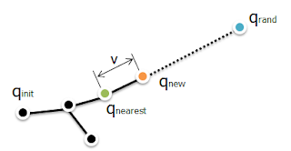

# Rapidly Exploring Random Trees

### Salient Features
1. Randomly samples nodes in the Configuration space of the robot to build a tree of valid configurations.
2. It is **Probabilistically Complete**,having the probability to find a solution _if it exists_. In worst case, time taken to find a solution can be very long (longer than exhaustive search). The probability of finding a solution goes to $1$ as number of sampled nodes goes to $\infty$.
3. In practise, the algorithm tends to be very effecitve in high dimensional spaces.
4. There is no gaurantee regarding the optimality of the solution. The path produced my bot the the shortest path.
5. Post processing of the path generated is required as the path generated is often very unordered or in zig-zag fashion.

### Intuition

The basic idea behind the algorithm is to start out at a start node and to generate random points in the configuration space and the tree is extended by connecting the randomly generated point to the closest node in the existing tree available.

There are a few key things to note here. Firstly, the points aren't joined directly. We take a **maximum distance between sampled node and nearest node** (called `DELTA` in the pseudocode). We extend the nearest node by this distance towards the randomly sampled node, if the sampled node is farther than this distance. Otherwise, if the sampled node is closer than this value, we directly connect the two nodes.



*Courtesy: [Joon's Lectures](https://joonlecture.blogspot.com/2011/02/improving-optimality-of-rrt-rrt.html)*

In the above image, $q_{rand}$ is the randomly sampled point, $q_{nearest}$ is the nearest (to $q_{rand}$) point in the tree. Since the distance between $q_{rand}$ and $q_{nearest}$ is greater than the maximum distance $v$, we connect $q_{nearest}$ to $q_{new}$, which is at a distance of $v$ from $q_{nearest}$.

This process is continuously carried out for many iterations until the goal is reached. The tree expands rapidly, and hence the name.

### Collision Checking Function
One important requirement of sampling algorithms, is the ability to check if a configuration is valid or not. To check if a configuration $X$ is valid in a _configuration free space_ $\mathbb{C}$, a function as such can be used:

$$
	CollisionCheck(X) = \begin{cases}
								0 \quad &\text{if} \, X \in \mathbb{C} \\
								1 \quad &\text{if} \, X \notin \mathbb{C}
						\end{cases} \\
$$

### Psuedo Code
```python
def RRT(START, GOAL):
	TREE = []
	TREE.add(START)
	DELTA = maximum distance between sampled node and nearest node. 
	REPEAT n times:
		X = generateNewConfiguration()
		if X in FREE_SPACE:
			for nodes in TREE:
				Y = argmin(nodes, criteria=distance)
			if DIST(X, Y) < DELTA:
				Find a configuration Z that is at DELTA distance along the path from X to Y
				if TRAVERSABLE(X, Z):
					X.parent = Y
					TREE.add(X)
			else:
				if TRAVERSABLE(X, Y):
					X.parent = Y
					TREE.add(X)
			if X is GOAL:
				report "SUCCESS"
				break

```
### Notations and Functions used in Psuedo Code:

- Function used to check if a path is traversable:

$$
	Traversable(X, Y) = \begin{cases}
						1 \quad &\text{if} \, \operatorname{LineJoining}(X, Y) \in \mathbb{C} \\
						0 \quad &\text{if} \, \operatorname{LineJoining}(X, Y) \notin \mathbb{C} \\
						\end{cases}
$$

- In case of Rotations:

$$
	Dist(X, Y) = \min{(\lvert X_n - Y_n \rvert}, \lvert\ 2\pi - \lvert X_n - Y_n \rvert \rvert) 
$$

### References
1. Refer [this](https://medium.com/@theclassytim/robotic-path-planning-rrt-and-rrt-212319121378) article for more information about RRT and RRT*
2. A [video](https://www.youtube.com/watch?v=xAmN8WnltRY) explaining RRT algorithm.
3. Refer to the paper [here](http://msl.cs.illinois.edu/~lavalle/papers/Lav98c.pdf)


